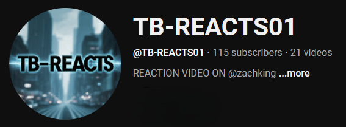
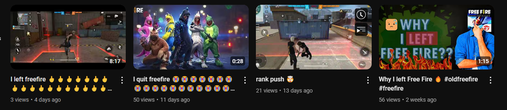

<html lang="en">
<head>
    <meta charset="UTF-8">
    <meta name="viewport" content="width=device-width, initial-scale=1.0">
    <title>TWINxBROTHERS</title>
    
</head>
<body text="WHITE">
    <input type="search" placeholder="search @tb-reacts01">

    
  
  <H2><pre> VIDEOS     SHORTS      LIVE      POSTS</pre></H2>
   
  <a href="https://youtu.be/Twno_Q2RGVI?si=pH-U_f4yOQ40TIMz">Video</a>
 </body>
</html>
